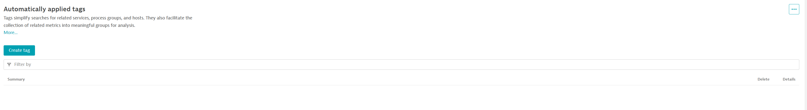

## Delete Tag

--8<-- "snippets/bizevent-delete-tag.js"

Now imagine you want to delete the tag in Dynatrace.

Remember that Crossplane is managing `config_as_code/main.tf` so let's comment out that out and save it back to Git.

!!! info "Delete vs. Comment Out"
    In the real-world, you would simply delete the file rather than comment it out.
    For demo purposes, we want you to still have the configuration for reference - hence we comment things out instead.

Crossplane will (after 1min) rescan your Git repo and notice the change (tag exists on Dynatrace but according to the repository, it shouldn't). Crossplane will then delete the tag from Dynatrace.

```{ "name": "comment out tag" }
# Surround existing content with /* ... */ to comment it out
sed -i '1i /*' /workspaces/$RepositoryName/config_as_code/main.tf
sed -i '$a */' /workspaces/$RepositoryName/config_as_code/main.tf
# Save changes back to Git
git add /workspaces/$RepositoryName/config_as_code/main.tf
git commit -m "comment out tag"
git push
```

!!! info "Wait for 1min"
    Remember to wait for 1 minute as that's how often Crossplane is configured to sync.

After 1 minute, refresh the Classic Settings app, Automatically applied tags settings page:

For example:
```
https://abc12345.apps.dynatrace.com/ui/apps/dynatrace.classic.settings/ui/settings/builtin:tags.auto-tagging
```

The auto tag should no longer exist in your Dynatrace environment.



<div class="grid cards" markdown>
- [Click Here to Continue :octicons-arrow-right-24:](whats-next.md)
</div>